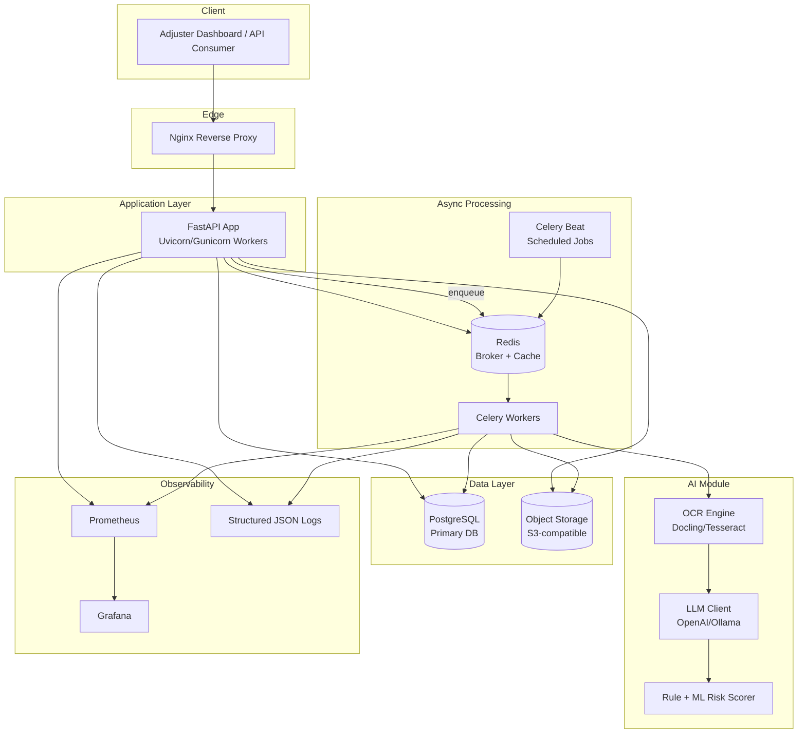
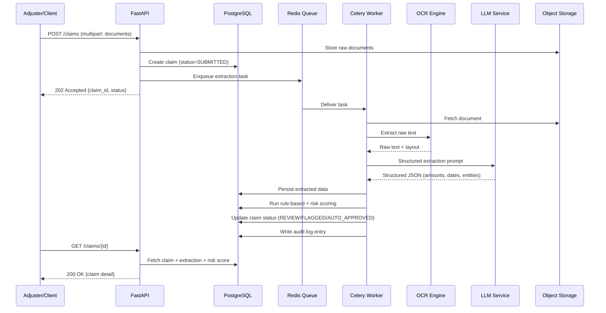
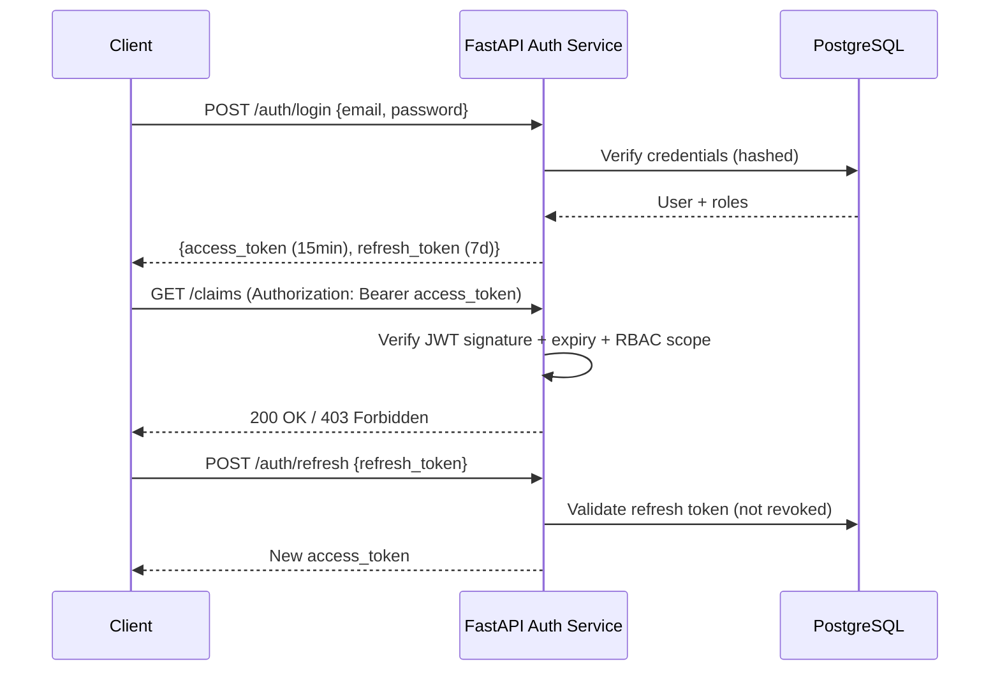
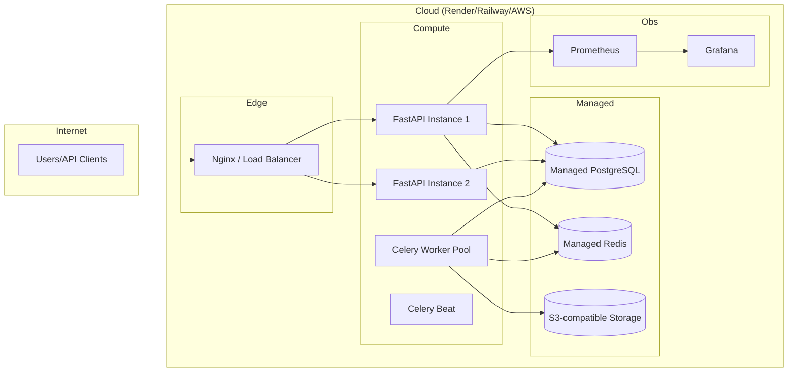
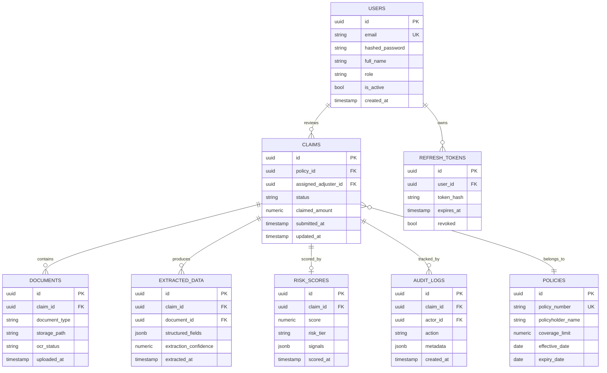

# ClaimForge AI
### AI-Native Insurance Claims Intelligence Platform
*Production-grade portfolio project — Python Backend + Applied AI*

---

## 1. Product Vision

### Problem Statement
Insurance carriers and TPAs (Third-Party Administrators) process thousands of claims a day. Each claim arrives as a bundle of unstructured documents — medical bills, invoices, ID proofs, policy forms, sometimes scanned or photographed. Adjusters manually read these documents, cross-check them against policy terms, and decide whether to approve, flag, or reject. This is slow (days per claim), inconsistent (different adjusters flag different things), and expensive (headcount scales linearly with claim volume). Fraud and data-entry errors slip through because manual review can't scale attention.

### Target Users
- **Claims Adjusters** — need a fast queue of pre-triaged, pre-summarized claims instead of raw document dumps.
- **Claims Operations Managers** — need visibility into throughput, risk distribution, and bottlenecks.
- **Compliance/Audit teams** — need a traceable record of every automated decision and the data it was based on.
- **Engineering/Product teams at insurers or InsurTechs** — evaluate this as a build-vs-buy reference architecture.

### Business Value
- Cuts manual document review time by automating extraction (OCR + LLM) instead of manual transcription.
- Reduces fraud leakage by scoring every claim consistently, instead of relying on individual adjuster judgment.
- Creates a full audit trail (who/what/when/why) for every automated decision — critical for insurance regulatory compliance.
- Lets a claims team **triage by risk** instead of FIFO, so high-risk / high-value claims get senior attention first.

### Competitor Landscape
- **Shift Technology, Tractable, Charlie Health (claims AI vendors)** — enterprise, expensive, closed-source, sold as a full BPO/SaaS package to large carriers.
- **In-house legacy claims systems** (what most mid-size insurers run today) — rules-engine only, no LLM-based extraction, brittle OCR.
- **Gap ClaimForge targets**: a lean, self-hostable, open-architecture claims intelligence layer that a mid-size insurer or TPA could deploy without a 7-figure vendor contract — this is the "why would a company pay for it" argument, and it's also exactly the story that makes this portfolio project credible to interviewers, since you're not reinventing a CRUD app, you're addressing a real gap.

### Why This Domain (vs. the other options)
Given your production experience at Digit Insurance (claims workflows, policy validation, document handling, AI wrapper integrations), **Claims Processing + AI Document Intelligence** is the domain where your resume narrative and the project narrative reinforce each other in an interview — you're not learning a new domain from scratch, you're re-implementing a real problem you've seen in production, in a new stack.

---

## 2. System Architecture

### High-Level Architecture



### Claim Processing Data Flow



### Authentication Flow



### Deployment Architecture



---

## 3. Folder Structure (Clean Architecture)

```
claimforge-ai/
├── app/
│   ├── api/                      # Presentation layer — routers only, no business logic
│   │   ├── v1/
│   │   │   ├── routes/
│   │   │   │   ├── auth.py
│   │   │   │   ├── claims.py
│   │   │   │   ├── documents.py
│   │   │   │   ├── adjusters.py
│   │   │   │   └── admin.py
│   │   │   └── deps.py           # FastAPI dependencies (auth, pagination, db session)
│   │   └── middleware/
│   │       ├── request_id.py
│   │       ├── error_handler.py
│   │       └── rate_limit.py
│   │
│   ├── core/                     # Cross-cutting config, no business logic
│   │   ├── config.py             # Pydantic Settings (env vars)
│   │   ├── security.py           # JWT encode/decode, password hashing
│   │   ├── logging.py            # Structured JSON logger setup
│   │   └── celery_app.py         # Celery app instance + config
│   │
│   ├── domain/                   # Enterprise business rules (framework-independent)
│   │   ├── entities/             # Pure Python domain models (not ORM)
│   │   │   ├── claim.py
│   │   │   └── risk_score.py
│   │   ├── value_objects/
│   │   └── exceptions.py         # Domain-specific exceptions
│   │
│   ├── services/                 # Application/use-case layer — orchestrates domain + repos
│   │   ├── claim_service.py
│   │   ├── extraction_service.py
│   │   ├── risk_scoring_service.py
│   │   └── auth_service.py
│   │
│   ├── repositories/             # Data access layer — Repository Pattern
│   │   ├── base_repository.py
│   │   ├── claim_repository.py
│   │   └── user_repository.py
│   │
│   ├── infrastructure/           # Adapters to external systems (DIP boundary)
│   │   ├── db/
│   │   │   ├── models.py         # SQLAlchemy ORM models
│   │   │   ├── session.py
│   │   │   └── migrations/       # Alembic
│   │   ├── ai/
│   │   │   ├── llm_client.py     # OpenAI/Ollama adapter
│   │   │   ├── ocr_client.py     # Docling/Tesseract adapter
│   │   │   └── prompts/
│   │   ├── storage/
│   │   │   └── s3_client.py
│   │   └── cache/
│   │       └── redis_client.py
│   │
│   ├── workers/                  # Celery tasks (thin — delegate to services)
│   │   ├── extraction_tasks.py
│   │   ├── scoring_tasks.py
│   │   └── scheduled_tasks.py
│   │
│   ├── schemas/                  # Pydantic request/response models (DTOs)
│   │   ├── claim.py
│   │   ├── auth.py
│   │   └── common.py             # Pagination, error envelope
│   │
│   └── main.py                   # FastAPI app factory
│
├── tests/
│   ├── unit/
│   ├── integration/
│   └── conftest.py               # Pytest fixtures, Factory Boy factories
│
├── alembic/
├── docker/
│   ├── Dockerfile
│   ├── docker-compose.yml
│   ├── docker-compose.prod.yml
│   └── nginx.conf
├── .github/
│   └── workflows/
│       ├── ci.yml
│       └── deploy.yml
├── docs/
│   └── mkdocs/
├── monitoring/
│   ├── prometheus.yml
│   └── grafana-dashboards/
├── .pre-commit-config.yaml
├── pyproject.toml
├── README.md
└── .env.example
```

**Why this shape:** `domain/` has zero framework imports (no FastAPI, no SQLAlchemy) — it's pure business logic, testable in isolation. `services/` orchestrates domain + repositories (dependency inversion: services depend on repository *interfaces*, not concrete DB code). `infrastructure/` is where all external-system code lives, so swapping Postgres for another DB or OpenAI for Ollama only touches one folder. `api/` stays a thin routing layer — no business logic in routers, which is the #1 thing interviewers check for in a "clean architecture" claim.

---

## 4. Database Design

### ER Diagram



### Key Tables, Constraints & Indexes

| Table | Notable Constraints | Indexes |
|---|---|---|
| `users` | `email` UNIQUE, `role` CHECK IN ('adjuster','manager','admin') | `idx_users_email` |
| `refresh_tokens` | FK `user_id` ON DELETE CASCADE, `token_hash` UNIQUE | `idx_refresh_user_id` |
| `policies` | `policy_number` UNIQUE, `expiry_date >= effective_date` CHECK | `idx_policy_number` |
| `claims` | FK `policy_id`, `status` CHECK IN ('SUBMITTED','PROCESSING','REVIEW','FLAGGED','APPROVED','REJECTED') | `idx_claims_status`, `idx_claims_policy_id`, `idx_claims_submitted_at` (for queue sorting) |
| `documents` | FK `claim_id` ON DELETE CASCADE | `idx_documents_claim_id` |
| `extracted_data` | FK `claim_id`, `document_id`; `structured_fields` is JSONB (GIN index for querying extracted fields) | `idx_extracted_claim_id`, `gin_extracted_fields` |
| `risk_scores` | FK `claim_id` UNIQUE (one active score per claim), `score` BETWEEN 0 AND 100 | `idx_risk_claim_id`, `idx_risk_tier` |
| `audit_logs` | FK `claim_id`, `actor_id`; append-only (no UPDATE/DELETE grants at DB role level) | `idx_audit_claim_id`, `idx_audit_created_at` |

**Design notes:**
- `audit_logs` is intentionally append-only at the DB permission level — this is what makes the "compliance/traceability" pitch credible, not just a marketing line.
- `structured_fields` and `signals` use JSONB because extracted document fields vary by document type (a medical bill has different fields than an ID proof) — a fixed relational schema would force nulls everywhere or constant migrations.
- Composite index on `(status, submitted_at)` for `claims` supports the adjuster queue's primary query pattern: "give me FLAGGED claims oldest-first."

---

## 5. Backend APIs (REST)

All endpoints are versioned under `/api/v1`. All list endpoints support `?page=&size=&sort=`. All mutating endpoints require JWT; role-gated ones are marked.

### Auth
| Method | Endpoint | Auth | Description |
|---|---|---|---|
| POST | `/auth/register` | none | Create adjuster/manager account (admin-invited in prod) |
| POST | `/auth/login` | none | Returns access + refresh token |
| POST | `/auth/refresh` | refresh token | Issues new access token |
| POST | `/auth/logout` | access token | Revokes refresh token |
| POST | `/auth/password-reset/request` | none | Sends reset email |
| POST | `/auth/password-reset/confirm` | reset token | Sets new password |

### Claims
| Method | Endpoint | Auth | Description |
|---|---|---|---|
| POST | `/claims` | adjuster+ | Create claim + upload documents (multipart), enqueues extraction |
| GET | `/claims` | adjuster+ | Paginated, filterable by `status`, `risk_tier`, `assigned_adjuster_id`, sortable by `submitted_at`/`risk_score` |
| GET | `/claims/{id}` | adjuster+ (own or manager) | Full claim detail incl. extracted data + risk score + audit trail |
| PATCH | `/claims/{id}/status` | adjuster+ | Manual override of claim status (creates audit log entry) |
| GET | `/claims/{id}/documents` | adjuster+ | List documents + OCR/extraction status |
| GET | `/claims/{id}/audit-log` | manager/admin | Full immutable action history |

**Example — `POST /claims`**
```
Request (multipart/form-data):
  policy_number: str
  claimed_amount: decimal
  documents: File[]  (max 10 files, 15MB each, pdf/jpg/png)

Response 202 Accepted:
{
  "claim_id": "uuid",
  "status": "SUBMITTED",
  "documents_received": 3,
  "estimated_processing_time_seconds": 45
}

Validation:
  - policy_number must exist in policies table -> 404 if not found
  - claimed_amount must be > 0 -> 422
  - file type/size validated before upload -> 415 / 413

Error Codes:
  400 - malformed request
  404 - policy not found
  413 - file too large
  415 - unsupported file type
  422 - validation error (Pydantic)
  429 - rate limited
```

**Example — `GET /claims?status=FLAGGED&sort=-risk_score&page=1&size=20`**
```json
{
  "items": [
    {
      "id": "uuid",
      "policy_number": "POL-2026-004821",
      "status": "FLAGGED",
      "claimed_amount": 45000.00,
      "risk_tier": "HIGH",
      "risk_score": 87.5,
      "submitted_at": "2026-07-10T09:15:00Z"
    }
  ],
  "page": 1,
  "size": 20,
  "total": 142,
  "total_pages": 8
}
```

---

## 6. Authentication & Authorization

- **JWT access tokens** (15 min TTL) signed with RS256; **refresh tokens** (7 day TTL) stored hashed in DB so they're revocable server-side (not just stateless).
- **RBAC** via a `role` claim embedded in the JWT: `adjuster` (own claims + assigned queue), `manager` (all claims, audit logs, dashboards), `admin` (user management, config).
- **Password reset**: time-limited, single-use signed token emailed to the user; token hash stored, not the raw token.
- **Email verification**: signup issues an unverified account; verification token gates login until confirmed (prevents fake-account claim spam in a real deployment).
- Dependency injection in FastAPI (`Depends(get_current_user)`, `Depends(require_role("manager"))`) keeps auth checks declarative at the route level rather than scattered through service code.

---

## 7. Background Processing

- **Celery + Redis** as broker; Redis also doubles as a cache for hot reads (e.g., dashboard aggregate counts).
- **Queues**: separate queues for `extraction` (OCR/LLM — slower, I/O bound) and `scoring` (fast, CPU-bound) so a backlog of document extraction doesn't starve risk scoring.
- **Retries**: exponential backoff (`max_retries=3`, `retry_backoff=True`) for transient failures (LLM API timeout, S3 throttling).
- **Dead Letter Queue**: tasks that exhaust retries are routed to a `failed_tasks` table with the original payload + error, surfaced on an admin dashboard for manual reprocessing — this is the detail that separates a "toy Celery example" from a production-minded one.
- **Scheduled jobs (Celery Beat)**: nightly re-scoring of claims still in `REVIEW` past a staleness threshold; daily audit-log integrity check; weekly stale-refresh-token cleanup.

---

## 8. AI Module

**Why AI is needed:** the bottleneck isn't decision-making (that's adjuster judgment) — it's the manual transcription of unstructured documents into structured, comparable data. AI here is doing extraction and triage, not the final approve/reject call — that framing matters both technically (keeps the system auditable) and in interviews (shows you understand where LLMs are appropriate vs. not).

- **OCR stage**: Docling/Tesseract converts scanned/photographed documents to raw text + layout metadata before the LLM sees them — cheaper and more reliable than sending raw images to a multimodal LLM for every document.
- **Extraction stage**: a constrained prompt (with a Pydantic schema passed as the expected output shape) asks the LLM to pull structured fields (amounts, dates, provider names, diagnosis codes) from OCR text — output is validated against the Pydantic schema before it's trusted; failed validation triggers a retry with a stricter prompt, not a silent bad write.
- **Model choice**: Ollama (local, e.g. Llama 3.1 8B) for development/cost control; OpenAI (GPT-4o-mini class) as a pluggable production adapter behind the same `llm_client` interface — swappable without touching service code, which is the DIP boundary paying off.
- **Cost optimization**: cache extraction results by document hash (if the same document is re-uploaded, skip the LLM call); use the smallest model that hits acceptable accuracy on a held-out labeled set rather than defaulting to the largest model.
- **Caching**: Redis caches LLM responses for identical prompts (rare but happens with duplicate claim submissions) and caches risk-scoring feature lookups.
- **Error handling**: LLM timeouts/rate-limits are retried by Celery; malformed JSON output is caught by Pydantic validation and re-prompted once before falling back to a `NEEDS_MANUAL_REVIEW` status rather than guessing.

---

## 9. Deployment

### `docker-compose.yml` (development)
```yaml
version: "3.9"
services:
  api:
    build: ./docker
    command: uvicorn app.main:app --host 0.0.0.0 --port 8000 --reload
    volumes: ["./app:/app/app"]
    ports: ["8000:8000"]
    env_file: .env
    depends_on: [db, redis]

  worker:
    build: ./docker
    command: celery -A app.core.celery_app worker --loglevel=info -Q extraction,scoring
    env_file: .env
    depends_on: [db, redis]

  beat:
    build: ./docker
    command: celery -A app.core.celery_app beat --loglevel=info
    env_file: .env
    depends_on: [redis]

  db:
    image: postgres:16
    environment:
      POSTGRES_DB: claimforge
      POSTGRES_USER: claimforge
      POSTGRES_PASSWORD: ${DB_PASSWORD}
    volumes: ["pgdata:/var/lib/postgresql/data"]
    healthcheck:
      test: ["CMD-SHELL", "pg_isready -U claimforge"]

  redis:
    image: redis:7-alpine
    healthcheck:
      test: ["CMD", "redis-cli", "ping"]

  nginx:
    image: nginx:alpine
    volumes: ["./docker/nginx.conf:/etc/nginx/nginx.conf"]
    ports: ["80:80"]
    depends_on: [api]

volumes:
  pgdata:
```

- **Secrets management**: `.env` for local dev only (git-ignored); production secrets injected via the platform's secret store (AWS Secrets Manager / Render env groups) — never committed, never baked into the image.
- **Health checks**: `/healthz` (liveness — process up) and `/readyz` (readiness — DB + Redis reachable) exposed by FastAPI, wired into Docker healthchecks and the load balancer.
- **GitHub Actions** (`ci.yml`): lint (Ruff/Black) → test (Pytest + coverage gate) → build image → push to registry; `deploy.yml` triggers on tag push (semantic versioning) and deploys to the chosen platform.

---

## 10. Monitoring & Logging

- **Prometheus** scrapes `/metrics` (request latency histograms, request count by status code, Celery queue depth, task success/failure rate).
- **Grafana** dashboards: API latency p50/p95/p99, claims-processed-per-hour, risk-tier distribution, Celery backlog.
- **Structured JSON logging** with a `request_id` (generated by middleware, propagated into Celery tasks via task headers) so a single claim's full journey — API call → queue → worker → DB write — is traceable through one correlation ID across logs.
- **Error tracking**: unhandled exceptions caught by a global FastAPI exception handler, logged with full context (request_id, user_id, endpoint), returned to the client as a sanitized error envelope (no stack traces leaked).

---

## 11. Testing

- **Unit tests**: domain logic and services in isolation, with repositories mocked — fast, no DB needed.
- **Integration tests**: real Postgres (via `testcontainers` or a dedicated test DB), real Redis, testing repository + service + DB interaction.
- **API tests**: `HTTPX` async client against the FastAPI app, covering auth flows, validation errors, and the full claim-submission-to-scoring happy path with Celery run in eager mode.
- **Factory Boy** factories for `User`, `Policy`, `Claim`, `Document` — avoids hand-writing repetitive fixture data.
- **Coverage target**: 80%+ on `domain/` and `services/` (the layers with actual logic); lower bar acceptable on `api/` routing glue.
- **CI pipeline**: every PR runs lint → unit → integration tests against a Postgres/Redis service container in GitHub Actions; merge blocked below coverage threshold.

---

## 12. Documentation (README outline)

```
# ClaimForge AI
[Badges: build status, coverage, license]

## Features
## Architecture Diagram (embed Mermaid)
## Screenshots
  [placeholder: adjuster dashboard]
  [placeholder: claim detail view]
## Quick Start
  git clone ...
  cp .env.example .env
  docker compose up --build
## API Documentation
  Swagger UI at /docs, ReDoc at /redoc
  Full API reference: see /docs/mkdocs
## Environment Variables
  [table: var name, description, default]
## Sequence & ER Diagrams
  (embed from Section 2 and 4 above)
## Roadmap
  - [ ] Multi-tenant support
  - [ ] Fraud pattern similarity search (pgvector)
  - [ ] Adjuster feedback loop to retrain risk model
## Contributing
## License
```

---

## 13. GitHub Repository Setup

- **Labels**: `type:feature`, `type:bug`, `type:tech-debt`, `priority:high/medium/low`, `area:api`, `area:ai`, `area:infra`.
- **Milestones**: one per weekly phase (see Section 16) — `M1: Foundation`, `M2: Claims Core`, `M3: Async + OCR`, `M4: AI Extraction`, `M5: Risk Scoring`, `M6: Observability`, `M7: Deployment`, `M8: Polish`.
- **Project Board**: `Backlog → In Progress → In Review → Done` columns, one issue per API endpoint / service / infra piece.
- **Release strategy**: `main` always deployable; feature branches → PR → squash merge; tag `v0.1.0` at end of each milestone (SemVer: MAJOR.MINOR.PATCH, breaking API changes bump MINOR pre-1.0).

---

## 14. Resume Entry

**Project Title:** ClaimForge AI — AI-Native Insurance Claims Intelligence Platform

**Tech Stack:** Python, FastAPI, PostgreSQL, SQLAlchemy, Alembic, Redis, Celery, JWT/RBAC, Docker, Nginx, GitHub Actions, Prometheus/Grafana, OpenAI/Ollama, OCR (Docling/Tesseract), Pytest

**Resume Bullets:**
- Architected a clean-architecture claims intelligence platform (FastAPI, PostgreSQL, Celery, Redis) with repository-pattern data access and dependency-injected services, containerized and CI/CD-deployed via Docker and GitHub Actions.
- Built an AI document-extraction pipeline combining OCR and LLM-based structured extraction with schema validation and confidence scoring, converting unstructured claim documents into auditable, queryable data.
- Implemented a rule-based and ML-assisted risk-scoring engine with JWT/RBAC-secured APIs, Prometheus/Grafana observability, and an immutable audit-log system for full decision traceability.

---

## 15. Interview Preparation — 30 Questions

**System Design**
1. How would you scale this system to 1M claims/day?
2. How do you prevent duplicate claim processing if the same document is uploaded twice?
3. Walk through what happens if the Celery worker crashes mid-extraction.
4. How would you shard the `claims` table if a single Postgres instance becomes a bottleneck?
5. How do you handle a partial failure (OCR succeeds, LLM extraction fails)?

**Backend/Architecture**
6. Why Repository Pattern over calling SQLAlchemy directly in services?
7. How does Dependency Injection make this codebase testable?
8. Why keep `domain/` framework-independent — what does that buy you?
9. How would you version this API without breaking existing clients?
10. What's your strategy for zero-downtime deployments here?

**FastAPI**
11. How does FastAPI's dependency injection differ from a typical DI container?
12. Sync vs async route handlers — when would you use each here?
13. How do you validate a multipart file upload's size/type before it hits disk?
14. How would you implement request-level rate limiting?
15. How do you structure Pydantic schemas to avoid leaking DB models to the API layer?

**PostgreSQL**
16. Why JSONB for `extracted_data` instead of a fully normalized schema?
17. How would you index `claims` for the adjuster queue's sort/filter pattern?
18. Explain how you'd design the audit log to be tamper-evident.
19. What's your migration strategy (Alembic) for a zero-downtime schema change?
20. How do you handle N+1 query problems when loading claim + documents + risk score?

**Redis/Celery**
21. Why separate queues for extraction vs. scoring?
22. How do retries with exponential backoff avoid a thundering-herd problem?
23. What's a Dead Letter Queue and why does it matter for production Celery?
24. How do you make a Celery task idempotent?
25. When would you choose Redis Streams over a plain Celery queue?

**AI**
26. Why OCR before LLM instead of feeding images directly to a multimodal model?
27. How do you validate that LLM output is trustworthy before writing it to the DB?
28. How would you detect and handle prompt injection from a malicious document?
29. How do you keep LLM costs bounded at scale?
30. How would you evaluate extraction accuracy over time without manual spot-checks alone?

---

## 16. Development Plan (8 Weekly Milestones)

Each milestone ends in a runnable, demoable state — not a half-built feature.

| Week | Milestone | Deliverable |
|---|---|---|
| 1 | **Foundation** | Repo scaffold, Docker Compose (API+DB+Redis), FastAPI health check, Alembic init, CI lint/test skeleton |
| 2 | **Auth & RBAC** | User model, JWT login/refresh, password reset, role-gated dependencies, auth tests |
| 3 | **Claims Core** | Policy + Claim + Document models/migrations, `POST/GET /claims` with repository pattern, pagination/filtering |
| 4 | **Async Pipeline** | Celery + Redis wired in, document upload → S3 → queued extraction task (stubbed), retry/DLQ handling |
| 5 | **AI Extraction** | OCR integration, LLM extraction with Pydantic-validated output, extraction confidence stored |
| 6 | **Risk Scoring** | Rule-based + simple ML risk scorer, claim status state machine, audit-log writes on every transition |
| 7 | **Observability** | Prometheus metrics, Grafana dashboards, structured JSON logging with request-ID propagation |
| 8 | **Deploy & Polish** | Nginx + prod Docker Compose, GitHub Actions deploy workflow, README + MkDocs, deploy to Render/Railway, load-test the pipeline |

---

*Next step: when you're ready to start writing actual code, Claude Code is the better environment for this — it can scaffold the repo, run the test suite, and iterate against real errors instead of generating unverified code blind.*
