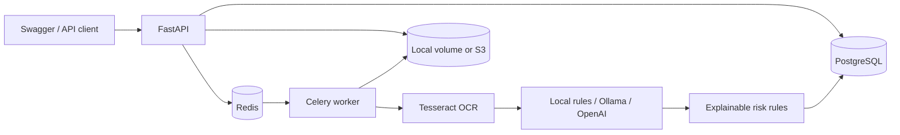

# ClaimForge AI — Collaboration-Realistic Project Design

## 1. Positioning

ClaimForge AI is an advanced backend portfolio project for a Python developer
with roughly 1–1.5 years of professional experience. It demonstrates a complete
business workflow without claiming to be a certified, enterprise insurance
platform.

The project is realistic for that experience level under the following working
model:

- the developer owns the requirements breakdown and implementation;
- official documentation is used for FastAPI, SQLAlchemy, Celery, and Docker;
- AI coding tools help with scaffolding, debugging, test generation, and review;
- an experienced developer reviews security, data modeling, and deployment
  decisions at milestone boundaries;
- third-party services such as PostgreSQL, Redis, Tesseract, Ollama/OpenAI, and
  S3 are integrated rather than reimplemented.

The developer must still be able to run the system, explain the important code,
debug normal failures, and describe which suggestions from collaborators were
accepted or rejected.

## 2. Problem statement

Claims adjusters receive PDFs and images containing bills, invoices, and claim
evidence. Manual transcription is slow and inconsistent. ClaimForge AI converts
these documents into structured fields and an explainable risk assessment so an
adjuster can prioritize review.

The application assists a human decision. It does not automatically reject a
real insurance claim.

## 3. Users and permissions

### Adjuster

- submits a claim;
- sees claims assigned to them;
- downloads their claim documents;
- reviews OCR/extraction and risk results;
- moves a claim through allowed workflow states.

### Manager

- sees all claims;
- reviews audit history;
- supervises flagged claims.

### Admin

- manages users and roles;
- inspects permanently failed background tasks.

## 4. Functional scope

### Included

- account registration, verification, login, refresh, logout, and reset;
- JWT authorization with adjuster/manager/admin roles;
- claim and document submission;
- PDF/JPEG/PNG validation;
- asynchronous OCR and structured extraction;
- offline extraction baseline plus Ollama/OpenAI adapters;
- explainable risk scoring;
- status state machine;
- audit log;
- scheduled token cleanup and stale-claim re-scoring;
- health, logs, metrics, tests, Docker, and CI.

### Deliberately excluded

- frontend dashboard;
- multi-tenant insurer isolation;
- trained fraud-detection model;
- automatic payment or final rejection;
- production handling of protected health information;
- Kubernetes, sharding, event streaming, or multi-region failover.

These exclusions keep the system large enough to be impressive but small enough
for one junior developer to understand.

## 5. Architecture



### Why this architecture is appropriate

- FastAPI provides typed APIs and generated documentation.
- PostgreSQL provides relational constraints and JSONB for variable extracted
  fields.
- Celery keeps OCR and model calls outside HTTP request time.
- Redis is sufficient as a portfolio-scale broker and cache.
- Adapter interfaces allow local development without AWS or a paid model.
- Domain functions keep the claim workflow and scoring easy to unit-test.

This is modular application architecture, not a microservice system. All
application code remains in one repository and deployable unit family.

## 6. Claim workflow

```text
SUBMITTED → PROCESSING → REVIEW → APPROVED
                         │       └→ REJECTED
                         └→ FLAGGED → APPROVED/REJECTED
```

1. The API validates metadata and documents.
2. Files are stored and the database transaction creates the claim/documents.
3. An extraction task is queued after the transaction commits.
4. The worker downloads each file and runs OCR.
5. Extracted output is validated with Pydantic.
6. The result is cached by file hash and stored idempotently by document.
7. Risk rules produce a 0–100 score and explainable signals.
8. The risk score is inserted or updated, and audit entries are written.

Schema-validation failures send the claim to human review. Transient storage,
OCR, database, or provider failures are allowed to reach Celery retry handling.

## 7. Data model

The main tables are:

- `users`: credentials, role, verification and password-token version;
- `refresh_tokens`: hashed, revocable refresh tokens;
- `policies`: policy number, validity, and coverage;
- `claims`: amount, status, policy, and assigned adjuster;
- `documents`: stored file key and OCR status;
- `extracted_data`: one structured extraction per document;
- `risk_scores`: one current score per claim;
- `audit_logs`: append-style history;
- `failed_tasks`: final Celery failures for admin inspection.

Important constraints include positive claim amounts, legal statuses/roles,
one extraction per document, and one active risk score per claim.

## 8. AI and OCR design

### OCR

Tesseract processes images. Poppler converts PDF pages into images first.
The Docker image installs both system tools, while the Python adapter checks
whether Tesseract is available before selecting the real engine.

### Extraction modes

`local_rules` is the default. It is an honest non-AI baseline that extracts a
few fields using regular expressions and makes the project runnable without
credentials.

`ollama` demonstrates a local LLM integration.

`openai` demonstrates a hosted model integration and is an optional dependency.

All modes return the same Pydantic model. LLM output is parsed and validated
before persistence. This makes model swapping and testing straightforward.

### Risk scoring

The scorer is rule-based and explainable. Signals include:

- amount above policy coverage;
- unusually high claim value;
- low OCR confidence;
- missing required fields;
- possible duplicate amount under the same policy.

This should be described as risk triage, not machine-learned fraud detection.

## 9. Security scope

- passwords are bcrypt-hashed;
- access tokens are short-lived;
- refresh tokens are rotated and stored only as hashes;
- password reset tokens contain a version that is incremented after use;
- user activity and current role are read from the database on requests;
- adjusters only access claims assigned to them;
- production refuses the default JWT secret;
- documents are returned through time-limited S3 URLs in production.

Before real use, add TLS, secret management, malware scanning, database-level
audit protections, encryption/key policy review, PHI controls, and a formal
threat model.

## 10. Failure handling

- Celery acknowledges tasks late so a worker crash can requeue work.
- Transient failures retry with backoff.
- Final task failures are stored in `failed_tasks`.
- Extraction updates are idempotent by document.
- Risk scoring updates the existing score instead of violating its uniqueness
  constraint during scheduled re-scoring.
- Invalid model output routes the claim to manual review.

## 11. Testing strategy

### Unit tests

- claim status transitions;
- explainable risk rules;
- claim submission orchestration;
- storage-key behavior.

### Integration/API tests

- health endpoint through the ASGI application;
- full authenticated submission flow is documented and should be enabled once
  Celery eager mode and database cleanup fixtures are added.

### CI

- Ruff and Black checks;
- Alembic migration against PostgreSQL;
- tests with PostgreSQL and Redis service containers;
- coverage report for domain/service logic;
- Docker image build.

For a junior project, reliable tests of the important business rules matter more
than advertising an arbitrary repository-wide coverage percentage.

## 12. Development plan

This is a reasonable 10–12 week part-time plan, or approximately 7–9 weeks of
focused full-time portfolio work.

| Week | Deliverable | Likely collaboration |
|---|---|---|
| 1 | Repository, Docker, health endpoint | Documentation and AI scaffolding |
| 2 | Models, Alembic, seed data | Schema review by senior |
| 3 | Registration/login/RBAC | Security checklist and code review |
| 4 | Claims APIs and authorization | API review |
| 5 | Upload validation and storage | Pair debugging |
| 6 | Celery/Redis pipeline | Documentation and mentor review |
| 7 | OCR and extraction adapters | AI assistance and sample documents |
| 8 | Risk scoring and audit log | Domain-rule review |
| 9 | Retries, idempotency, scheduled jobs | Senior failure-mode review |
| 10 | Tests and CI | AI-generated test ideas, developer verification |
| 11 | Metrics, Docker production shape | DevOps review |
| 12 | README, demo, interview preparation | Peer mock interview |

## 13. Complexity for 1–1.5 years of experience

| Area | Complexity | Expected ownership |
|---|---:|---|
| CRUD, schemas, basic SQL | 5/10 | Independent |
| Authentication/RBAC | 7/10 | Implement with review |
| Celery and retries | 8/10 | Documentation plus guidance |
| OCR/LLM integration | 7/10 | Integrate existing tools |
| Idempotency/failure modes | 8/10 | Senior review recommended |
| Docker/CI/monitoring | 7/10 | Templates plus debugging |
| Real insurance production readiness | 9/10 | Outside project claim |

Overall portfolio complexity is approximately **7.5/10**. The implementation is
credible for a junior developer because collaboration is explicit and the
developer is not claiming to have invented each technology or solved regulated
production deployment alone.

## 14. How to discuss collaboration honestly

A good interview explanation:

> I owned the project and assembled the working system. I used AI tools to
> generate initial scaffolding and test ideas, then ran, reviewed, and corrected
> the output. I used documentation for integrations and asked experienced
> developers to review security, retry, and deployment choices. I can explain
> the final code and the defects found during review.

Avoid:

- “AI built the whole project.”
- “I independently architected a production insurance platform.”
- “The risk score detects fraud using machine learning.”
- “It is HIPAA/insurance-compliance ready.”

Collaboration strengthens the story when the developer can identify concrete
review findings: shared worker storage, Celery retry behavior, idempotent
re-scoring, claim-level authorization, missing system OCR dependencies, and
single-use password-reset handling.

## 15. Resume entry

**ClaimForge AI — Insurance Claims Intelligence Backend**

- Built a FastAPI/PostgreSQL claims-processing MVP with JWT/RBAC, assigned-claim
  authorization, document uploads, and auditable workflow transitions.
- Implemented a Celery/Redis document pipeline using Tesseract OCR and
  pluggable local/Ollama/OpenAI extraction adapters with Pydantic validation,
  retry handling, and idempotent persistence.
- Added explainable risk scoring, Alembic migrations, Pytest coverage, Docker
  Compose, GitHub Actions, structured logging, and Prometheus metrics.

These bullets are appropriate after the developer has personally run the stack,
tested the full demo, and can explain the implementation.

## 16. Completion checklist

Before publishing:

- run the Docker stack;
- apply the migration and seed data;
- submit at least one image and one PDF claim;
- verify API and worker share stored documents;
- test local-rules mode;
- optionally record an Ollama/OpenAI demo;
- demonstrate adjuster claim isolation;
- force a retry and inspect a failed-task record;
- capture test and CI results;
- remove real secrets and customer data;
- add screenshots or a short demo video.
