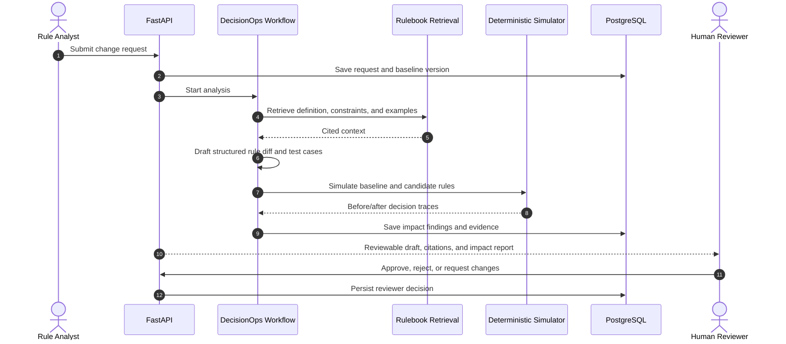
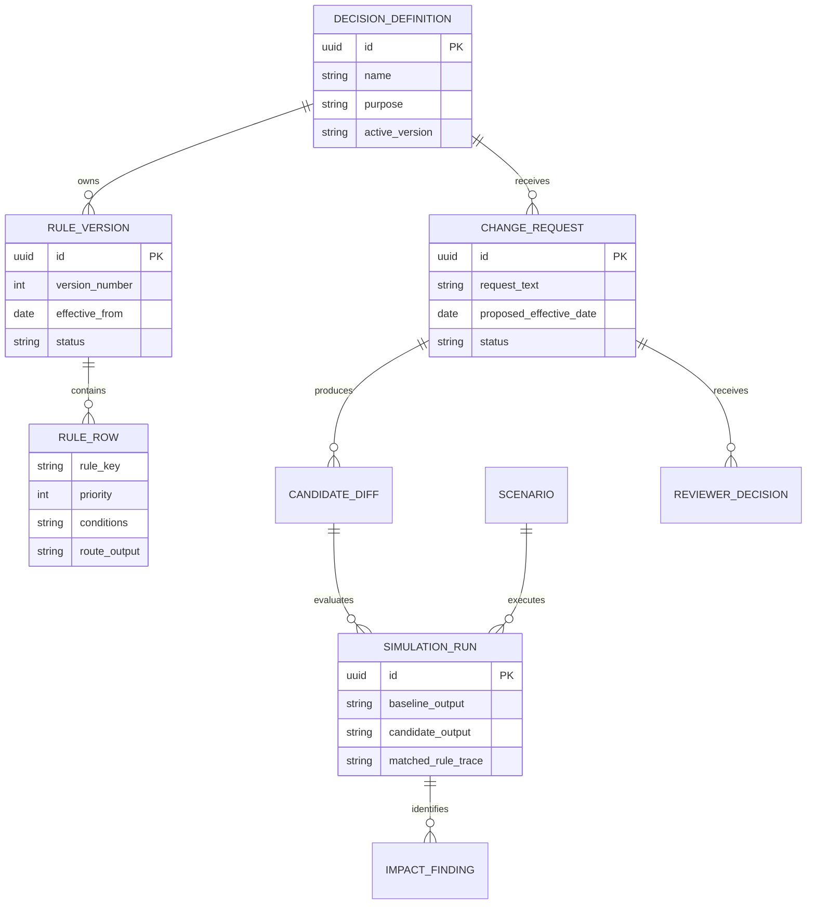
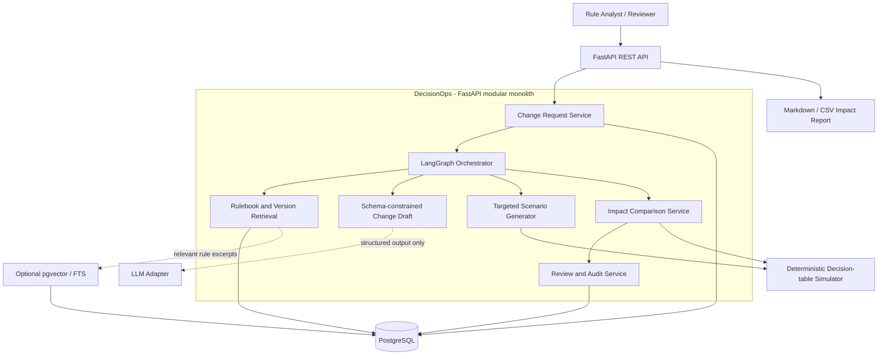
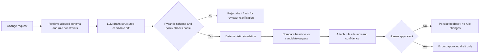
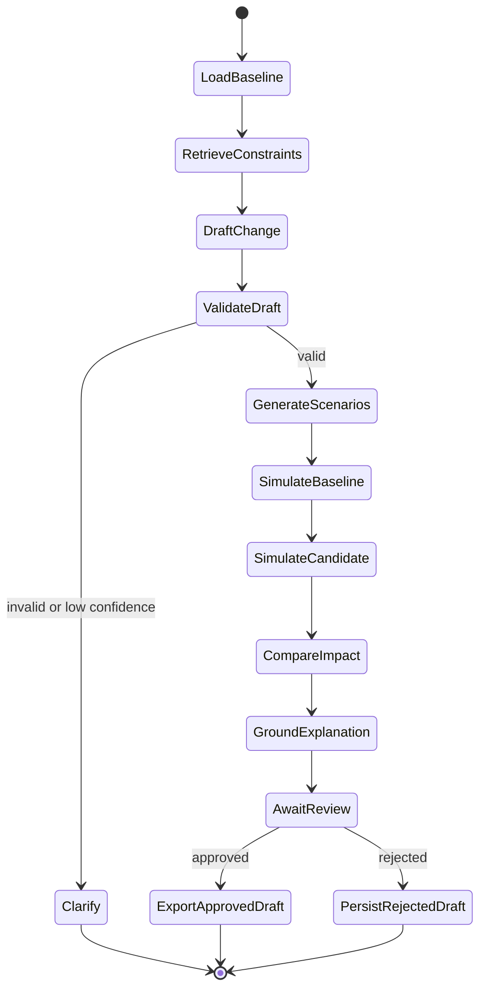
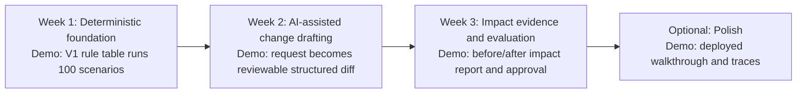

# DecisionOps Copilot

## AI-assisted, human-reviewed decision-table change impact

**Portfolio project blueprint** | **Target level:** AI/ML Engineer, 1-1.5 years | **Build:** 3-week MVP, optional Week 4 polish

> **One-line pitch:** DecisionOps converts a proposed change to a small, versioned decision table into a schema-validated draft, targeted test scenarios, a deterministic before/after impact simulation, and a cited review report. A human must approve every draft; the application never changes a live rule or makes a real insurance decision.

---

## 1. Why this is the right project now

The repository audit changed the recommendation.

- Existing services already own configurable Excel templates, header mapping, deterministic row validation, feedback files, asynchronous job tracking, error summaries, and separate enrollment persistence.
- PolicyMind already covers policy RAG, SQL retrieval, and hybrid answers.
- This project instead extends a real enterprise pattern: versioned decision/rule tables and decision traces. It demonstrates AI engineering around change safety, evaluation, and human review rather than rebuilding a workflow you already have.

### Reality check

| Build in the 3-week MVP | Add only after MVP works | Do not build |
|---|---|---|
| One FastAPI modular monolith and one synthetic rule table | LangGraph trace viewer, pgvector retrieval, minimal UI | Microservices, Kafka, Camunda/DMN runtime integration |
| Rule versions, deterministic simulator, review records | More rule tables and model-provider switching | Live-rule deployment, pricing, underwriting, policy issuance |
| Structured AI change draft, grounded explanation, test generation | Batch comparison of versions | Real customer/company data or credentials |
| Golden dataset and measured evaluation | Docker deployment/video polish | Claims of autonomous decision making |

**Effort:** 50-70 focused hours. The project is realistic because the deterministic simulator is intentionally small and the AI layer has a narrow, measurable contract.

---

## 2. The user problem

A business or operations analyst proposes a change in plain language:

> "From 1 September, route complete submissions for the 61+ age band to manual review. Keep the missing-document rule unchanged."

Today, someone must translate that request into a rule change, decide which cases are affected, test it, and explain the result to a reviewer. DecisionOps makes that work auditable.

### What the demo shows

1. Submit a synthetic change request against Rule Version 1.
2. Retrieve the relevant synthetic rulebook and decision-table rows.
3. Produce a schema-constrained candidate diff, including uncertainty and citations.
4. Generate targeted scenarios and run the deterministic simulator on Version 1 and the candidate Version 2.
5. Show exactly which scenario outcomes changed, why, and what a reviewer must approve.



---

## 3. Domain and synthetic dataset

Use a **toy operations-routing decision table**, inspired by group-health quote/rule concepts but independent of company systems. The table returns one of three safe, non-binding outputs:

- `STRAIGHT_THROUGH`
- `REFER_TO_REVIEW`
- `REQUEST_INFORMATION`

It is only a simulation artifact. It must not determine eligibility, price, underwriting outcome, or policy issuance.

### Synthetic entities

| Entity | Purpose |
|---|---|
| `DecisionDefinition` | Name, purpose, allowed inputs/outputs, effective dates |
| `RuleVersion` | Immutable V1/V2 decision-table snapshot |
| `RuleRow` | Priority, conditions, output, rationale |
| `ChangeRequest` | Natural-language request, effective date, author, status |
| `Scenario` | Synthetic input combination used for simulation |
| `SimulationRun` | Baseline/candidate output and matched rule trace |
| `ImpactFinding` | Changed outcome, reason, severity, linked evidence |
| `ReviewerDecision` | Approval, rejection, or revision note |

### Dataset target

- One decision table with **25-40 rule rows** and two synthetic versions.
- **100-200 generated scenarios** plus 30-50 hand-labelled edge cases.
- **20-30 natural-language change requests** with expected structured diffs and impacted scenarios.
- A short, versioned rulebook describing allowed values, precedence, effective dates, and non-negotiable constraints.
- All records, names, IDs, and values are generated; do not copy source spreadsheets, production rules, configuration, or credentials.



---

## 4. Architecture

### High-level design



### Non-negotiable AI boundary



**Important:** the LLM never decides the routing outcome. The simulator evaluates rule rows, and a reviewer is the only authority to approve a draft.

### LangGraph workflow



---

## 5. Clean architecture and technology mapping

```text
decisionops/
├── app/
│   ├── api/             FastAPI routers and Pydantic request/response models
│   ├── domain/          rule/version/change/scenario entities and invariants
│   ├── services/        change analysis, simulation, impact, review services
│   ├── repositories/    ports plus PostgreSQL implementations
│   ├── infra/           SQLAlchemy, LLM, retrieval, report/export adapters
│   ├── workflows/       LangGraph state, nodes, and graph assembly
│   └── evaluation/      golden cases, scorers, benchmark reports
├── data/
│   ├── synthetic_rules/
│   ├── synthetic_scenarios/
│   └── rulebook/
├── tests/
└── docker-compose.yml
```

| Existing strength | New project equivalent |
|---|---|
| Java controller -> service -> repository boundaries | FastAPI router -> service -> repository port boundaries |
| DTO validation and explicit request contracts | Pydantic models plus schema-constrained LLM output |
| JPA/database-backed rule and decision entities | SQLAlchemy/Alembic/PostgreSQL versioned rule storage |
| Deterministic business-rule execution | Small Python decision-table simulator as source of truth |
| Async jobs, statuses, and audit records | Change-analysis job lifecycle and reviewer decision audit |
| External client adapters | Isolated LLM/retrieval adapters with no company dependency |
| Test-driven Java validation | Pytest golden cases and before/after impact evaluation |

### Planned API surface

| Endpoint | Purpose |
|---|---|
| `POST /decision-definitions` | Create/load a synthetic decision definition |
| `POST /change-requests` | Submit text request against a baseline version |
| `GET /change-requests/{id}` | Draft status, citations, confidence, and impact summary |
| `GET /change-requests/{id}/simulation-runs` | Before/after traces for every affected scenario |
| `POST /change-requests/{id}/review` | Approve, reject, or ask for revision |
| `GET /change-requests/{id}/export` | Export approved draft, test cases, and impact report |

---

## 6. Three-week build plan



| Week | Build | Demoable outcome |
|---|---|---|
| 1 | Synthetic rule/version schema, deterministic priority evaluator, scenario generator, FastAPI, Postgres | Run V1 against 100 scenarios and inspect decision traces |
| 2 | Rulebook retrieval, Pydantic change-draft schema, LLM adapter, confidence/clarification route | Submit a change request and receive a constrained candidate diff plus test cases |
| 3 | Candidate simulator, impact comparison, citations, reviewer decision, evaluation harness, Docker Compose | Show exactly which scenarios changed and export an approved draft |
| 4 optional | LangGraph traces, pgvector, small UI, performance polish, recorded demo | Deploy and walk through an audited change end-to-end |

---

## 7. Evaluation plan

Use only held-out synthetic data. Report methodology, dataset size, and failure cases; never claim business impact or production accuracy.

| Metric | What it measures | MVP target |
|---|---|---|
| Structured-diff validity | Can the draft be safely parsed? | >=99% valid against Pydantic schema |
| Field/operator/value exact match | Does AI express the intended rule change? | >=90% on labelled change requests |
| Affected-scenario recall | Did simulation find every intended changed case? | >=95% on golden scenarios |
| Changed-vs-unchanged impact F1 | Are impact reports accurate? | >=0.95 |
| Rule-citation precision | Are cited rule excerpts actually relevant? | >=90% reviewer-checked |
| Clarification routing precision | Are low-confidence requests escalated appropriately? | Track and report; no target before measurement |
| P95 analysis latency | Is the workflow practical for a small batch? | <10 seconds for 100 scenarios, excluding model cold start |

### Required test categories

- Ambiguous change requests must create a clarification task rather than inventing a rule.
- Invalid operator/value combinations must be rejected before simulation.
- No candidate version may mutate the immutable baseline version.
- Every generated rationale must cite a rulebook or rule-row identifier.
- Rules with equal priority require deterministic tie-breaking tests.

---

## 8. Scope controls

### Keep

- One decision table, 25-40 rules, three outputs, two versions.
- A human-review gate before any export is marked approved.
- A small versioned Markdown/SQL rulebook; use PostgreSQL full-text search first.
- A compact synthetic scenario generator and a clear data dictionary.

### Defer or exclude

- A real DMN/Camunda runtime, rule authoring UI, multi-table dependencies, rule deployment, webhooks, Kafka, auth, and multi-tenancy.
- Full RAG infrastructure if the rulebook is only a few pages; pgvector is a Week 4 enhancement, not an MVP requirement.
- Any real insurance price, underwriting, claims, or policy decision.

### If schedule slips

1. Ship deterministic V1/V2 simulation, a manually supplied structured change draft, and the evaluation report.
2. Add LLM parsing for only five labelled change-request patterns.
3. Replace vector search with explicit rule IDs and keyword search.
4. Use Swagger/OpenAPI and Markdown/CSV exports instead of a frontend.

---

## 9. Interview and resume story

### Resume-safe claims - only after you build and measure them

- Built a containerized FastAPI/PostgreSQL change-impact service for synthetic, versioned decision tables with immutable baseline/candidate simulations.
- Implemented schema-constrained LLM drafting and rule-grounded explanations, with human review required before an approved export.
- Created a deterministic simulator and golden-scenario evaluation harness for structured-diff accuracy, affected-case recall, impact F1, citation precision, and latency.
- Applied clean architecture to separate domain rules, application services, repository ports, infrastructure adapters, and LangGraph workflow orchestration.

### Strong interview answer

> "I deliberately did not build an autonomous rules agent. The model converts ambiguous human intent into a constrained draft and explains it with evidence. A deterministic evaluator calculates impact, and a reviewer owns approval. That split makes the system auditable and testable."

### Definition of done

- [ ] `docker compose up` starts FastAPI and PostgreSQL.
- [ ] A synthetic V1 decision table and scenario set can be loaded and evaluated.
- [ ] A text change request produces a schema-valid candidate draft or a clarification request.
- [ ] Baseline and candidate results are compared with decision traces.
- [ ] A reviewer decision and export are persisted without mutating the baseline.
- [ ] The evaluation command produces a versioned metrics report.
- [ ] README includes the synthetic-data disclaimer, diagrams, dataset description, and a two-minute demo script.

---

## Final recommendation

Build **DecisionOps Copilot / RuleChange Guard**, not an Excel validator or enrollment engine. It is a clear next project after PolicyMind: more operational, more evaluable, and firmly grounded in the decision/rule-management patterns visible in the Java systems, while remaining independent and credible for 1-1.5 years of AI/ML engineering experience.
