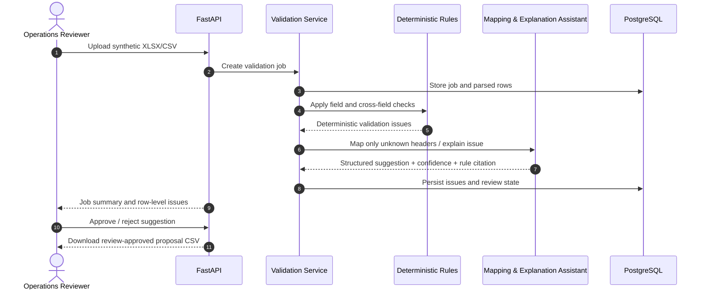
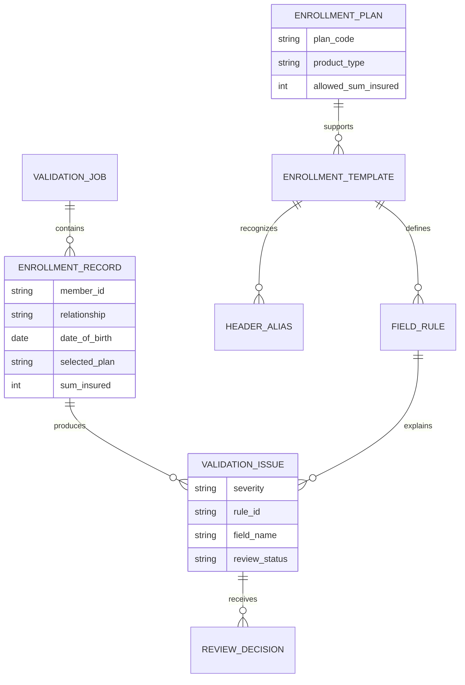
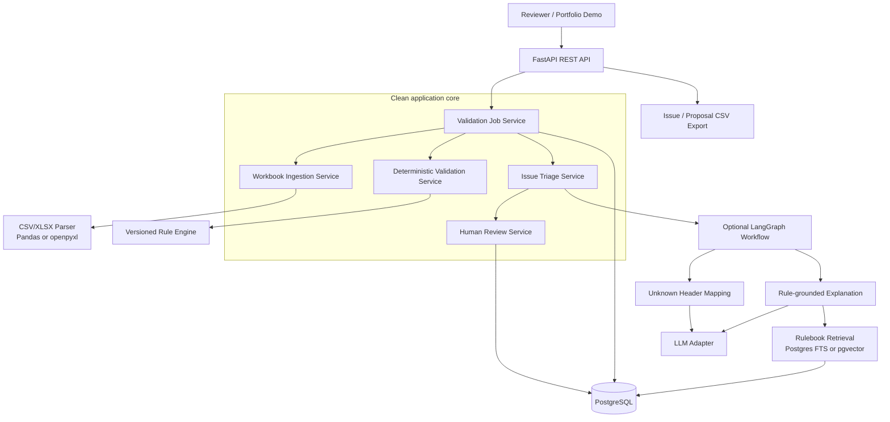
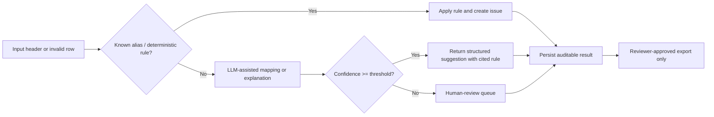
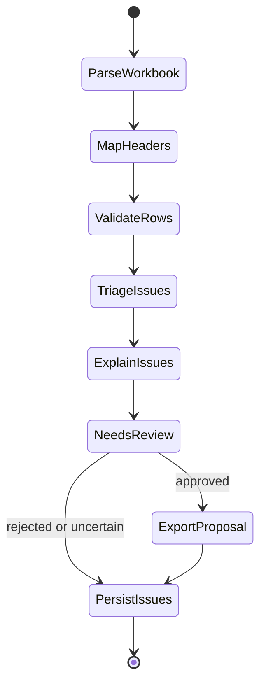

# EnrollmentLens

## A confidence-aware enrollment data-quality copilot

**Portfolio project blueprint** · **Target level:** AI/ML Engineer, 1–1.5 years · **Build time:** 3 weeks for the MVP; 4 weeks with polish

> **Positioning:** A human-in-the-loop service that validates synthetic group-health enrollment workbooks, explains issues with cited rules, and produces reviewable correction proposals. It is deliberately not another policy/claims chatbot, which keeps it distinct from PolicyMind.

---

## 1. Is this realistic?

### Yes — with a deliberately narrow MVP

This is a credible project for 1–1.5 years of experience because it extends familiar backend work (REST, PostgreSQL, validation, batch/file processing, layered architecture) into practical AI engineering (structured LLM output, confidence routing, evaluation, and human review).

| Green: build in the MVP | Yellow: add only if the MVP is stable | Red: explicitly out of scope |
|---|---|---|
| One FastAPI service, PostgreSQL, CSV/XLSX upload, 6–8 deterministic rules | LangGraph workflow and small rulebook retrieval | Multiple microservices, Kafka, real insurer/HR integrations |
| Synthetic 500–1,000-row workbooks | LLM mapping of unknown headers | OCR, PDFs, scanned forms, multi-tenant auth |
| Row-level issues, approval endpoint, correction CSV export | Minimal reviewer page | Autonomous edits to source data |
| Golden test dataset and measured metrics | pgvector semantic rule retrieval | “Production-grade” or unmeasured business-impact claims |

**Expected effort:** roughly 50–70 focused hours. The deterministic path must work before adding AI. The LLM assists with ambiguity and explanations; it never becomes the source of truth.

---

## 2. Problem and demonstration story

HR or operations teams receive enrollment spreadsheets with inconsistent headers and data-quality problems. Manual checks are slow, opaque, and repetitive.

**EnrollmentLens flow:** upload a synthetic workbook → validate and identify bad rows → explain the relevant rule → route uncertain cases to a reviewer → export approved correction proposals.



### Demo scenario

1. Upload `acme_enrollment_june.xlsx` with deliberately seeded errors.
2. Show that `Employee No.` maps to `member_id`, while an uncertain header is sent to review.
3. Show a row rejected for a duplicate member ID, invalid date of birth, or incompatible plan/sum insured.
4. Open the cited synthetic rule, approve a proposed correction, and download a separate proposal file.

---

## 3. Domain and independent dataset

The domain borrows the **shape** of group-health enrollment and template-validation workflows found in the existing repositories, but uses no company files, records, or integrations.

| Domain concept | Independent project entity | Purpose |
|---|---|---|
| Policy / plan master | `EnrollmentPlan` | Plan code, sum-insured options, eligibility rules |
| Template and field mapping | `EnrollmentTemplate`, `FieldRule`, `HeaderAlias` | Canonical columns, requiredness, regex, value maps |
| Employee/member enrollment | `EnrollmentRecord` | Employee/dependent demographics and coverage selection |
| Row error summary | `ValidationIssue` | Rule, severity, source field, evidence, suggested fix |
| File-operation lifecycle | `ValidationJob`, `ReviewDecision` | Upload status, audit trail, human approval |

### Synthetic dataset design

- Generate **one** group-health template and **500–1,000** synthetic employee/dependent records.
- Use generic identifiers and fake people only; publish the data dictionary and generator assumptions.
- Keep a held-out **100–200-row golden set** with known expected results.
- Inject realistic errors: missing mandatory values, duplicate member IDs, invalid email/mobile, invalid relationship, DOB/age mismatch, invalid dates, unsupported plan/sum insured, and invalid policy window.
- Store a small synthetic rulebook in Markdown/PostgreSQL. It is the only corpus used for retrieval; raw uploads are not embedded.



---

## 4. Architecture

### High-level system design



### Decision boundary: deterministic first, AI only for ambiguity



### LangGraph workflow — stretch after the core works



The initial implementation can run these services sequentially. Introduce LangGraph only when the deterministic upload-to-result path is tested and demoable.

---

## 5. Clean architecture and technology translation

```text
enrollment-lens/
├── app/
│   ├── api/             FastAPI routers, request/response schemas
│   ├── domain/          entities, value objects, validation rules
│   ├── services/        ingestion, mapping, validation, triage, review
│   ├── repositories/    repository ports and PostgreSQL implementations
│   ├── infra/           DB, Excel parser, LLM, retrieval, export adapters
│   ├── workflows/       LangGraph state and graph assembly
│   └── evaluation/      golden cases, metrics, report generation
├── data/                synthetic templates, rulebook, generated workbooks
├── tests/
└── docker-compose.yml
```

| Existing strength | Project equivalent / new learning |
|---|---|
| Spring controller → service → repository | FastAPI router → service → repository port |
| DTOs and Bean Validation | Pydantic models and structured LLM response schemas |
| JPA + PostgreSQL | SQLAlchemy/Alembic + PostgreSQL |
| Excel upload and business-rule validation | Pandas/openpyxl parsing and testable Python rules |
| REST operations and status endpoints | Validation-job lifecycle APIs |
| Strategy/layered business logic | LangGraph state machine only for AI-assisted branches |
| Containerized services | Docker Compose for FastAPI and PostgreSQL |

### Planned API surface

| Endpoint | Outcome |
|---|---|
| `POST /validation-jobs` | Upload file and start a validation job |
| `GET /validation-jobs/{id}` | Job state, summary, and metrics |
| `GET /validation-jobs/{id}/issues` | Filterable row-level issues |
| `POST /issues/{id}/review-decisions` | Approve, reject, or edit a suggestion |
| `GET /validation-jobs/{id}/export` | Download issue report or approved proposal CSV |

---

## 6. Delivery plan

```mermaid
gantt
    title EnrollmentLens delivery plan
    dateFormat  YYYY-MM-DD
    axisFormat  Week %W
    section Week 1 — deterministic MVP
    Data dictionary and synthetic generator   :w1a, 2026-08-03, 2d
    Upload, persistence, and rule engine      :w1b, after w1a, 3d
    Demo: row-level error report               :milestone, w1m, 2026-08-09, 0d
    section Week 2 — AI assistance
    Header aliases and confidence routing      :w2a, 2026-08-10, 2d
    Structured explanation and small rulebook  :w2b, after w2a, 3d
    Demo: uncertain mapping to review          :milestone, w2m, 2026-08-16, 0d
    section Week 3 — evidence and polish
    Review/export flow and test suite          :w3a, 2026-08-17, 3d
    Evaluation report and Docker Compose       :w3b, after w3a, 2d
    Demo: measured end-to-end workflow         :milestone, w3m, 2026-08-23, 0d
    section Optional Week 4
    LangGraph, pgvector, UI, and demo video    :w4a, 2026-08-24, 5d
```

| Week | Build target | Demoable outcome |
|---|---|---|
| 1 | Synthetic data, upload API, database, 6–8 rules | Upload a workbook and show row-level issues |
| 2 | Header aliases, confidence routing, structured explanations | Show known vs. uncertain header handling with cited rules |
| 3 | Human review, export, tests, metrics, Docker Compose | Reviewer approves a proposal and exports a report |
| 4 (optional) | LangGraph, pgvector, minimal UI, video | Show traceable AI-assisted workflow and architecture |

---

## 7. Evaluation plan

Do not invent performance claims. Report all results against the held-out, seeded-error dataset and label its limitations in the README.

| Metric | What it proves | MVP target |
|---|---|---|
| Header-to-canonical-field exact accuracy | Mapping quality | >=95% on held-out header variants |
| Seeded-error precision / recall / F1 | End-to-end validation quality | F1 >=0.90 |
| False-positive rate on valid rows | Rules are not noisy | <2% |
| Duplicate-ID precision / recall | High-value deterministic check | >=99% |
| Rule-citation Recall@3 | Explanations are grounded | >=90% |
| Structured-output validity | LLM output can be consumed safely | >=99% |
| Reviewer acceptance rate | Suggestion usefulness | Record it; do not set a claim before measuring |
| P95 processing time | Practical batch performance | <15 seconds for 1,000 rows |

### Evidence captured per run

- Template/rule version, input row count, parser/mapping confidence, issue counts by severity, reviewer decisions, latency, and evaluation version.
- Keep the input synthetic and retain only generated artifacts in the repository.

---

## 8. Scope controls and fallback plan

### Do not build initially

- OCR, PDF/image forms, live HR or insurance APIs, authentication/roles, multi-tenancy, Kafka, microservice splitting, or autonomous correction.
- LLM calls per spreadsheet row. Batch deterministic validation first; call the model only for unknown headers or selected issue explanations.

### If the schedule slips

1. Ship the Week 1 deterministic service with a strong synthetic dataset and evaluation report.
2. Use an alias table plus fuzzy matching before adding an LLM.
3. Keep rule retrieval in PostgreSQL/Markdown; add pgvector only as a Week 4 enhancement.
4. Use Swagger/OpenAPI and CSV export instead of building a frontend.

---

## 9. Portfolio narrative

### Resume-safe claims — use only after building and measuring

- Built and containerized a FastAPI/PostgreSQL data-quality service for synthetic group-health enrollment files, returning row-level, reviewable validation issues.
- Implemented deterministic eligibility, demographic, plan-compatibility, and duplicate-record checks; evaluated them on a labeled synthetic test set.
- Added structured LLM-assisted header normalization and rule-grounded explanations with confidence-based human-review routing.
- Applied clean architecture to separate domain rules, application services, repositories, infrastructure adapters, and AI workflow components.
- Created an evaluation harness for validation accuracy, header mapping, structured-output validity, and batch latency.

### Claims to avoid

- “Production-grade,” “reduced operational cost,” “real customer data,” “autonomous remediation,” or any metric not measured on the documented test set.

### Definition of done

- [ ] `docker compose up` starts the API and database.
- [ ] A sample synthetic workbook produces a persisted validation job and row-level issue report.
- [ ] At least six deterministic rules have automated tests.
- [ ] An uncertain header or issue can enter a human-review flow.
- [ ] The evaluation command produces a versioned metrics report.
- [ ] README includes this architecture, a two-minute demo script, data disclaimer, and measured results.

---

## Final recommendation

Build **EnrollmentLens as a focused human-in-the-loop data-quality copilot**, not as a broad “insurance AI platform.” That framing makes it ambitious enough for an AI Engineer portfolio while remaining believable, finishable, and easy to defend in an interview at 1–1.5 years of experience.
